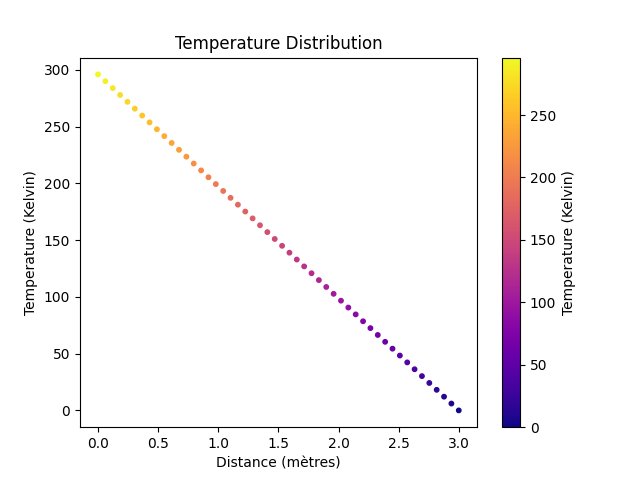

# Compte rendu Guillaume Calderon - Eymeric Déchelette

## Détermination de la formule

Nous sommes partis de l'équation de la chaleur : $(delphi)/(delt)+grad*(phiV)=S$

### Méthode analytique

Nous avons commencé par simplifier l'expression :
Tout d'abord, nous avons considéré que l'objet ne bougeait pas, et également qu'il était uniforme.
Nous avons ensuite supposé qu'aucune source de chaleur active n'existait.

### Méthode numérique

Au précedent cours, nous avions simplifié l'équation de la chaleur par : $(d^2T)/(dx^2)=0$
On sait que $(dT)/(dx)=lim_(xtoa)(T(x+a)-T(a))/(x-a)=lim_(xto)(T(x)-T(a))/(Deltax)$
Nous obtenons donc : $(d^2T)/(dx^2)=lim_(xto0)(lim_(xto0)(T_(j+1)-T_j)/(Deltax))(T_j-T_(j-1))/(Deltax)$
Ainsi : $(d^2T)/(dx^2)=lim_(xto0)(T_(j-1)-2T_j+T_(j+1))/(Deltax)^2=0$

## Détermination de la matrice

Avec la formule précente : $(d^2T)/(dx^2)=lim_(xto0)(T_(j-1)-2T_j+T_(j+1))/(Deltax)^2=0$, 
On peut déduire que sous forme matricielle cela s'écrit : $((296),(0),(vdots),(0))=((1,0,0,ldots,0),(1,-2,1,ddots,vdots),(0,ddots,ddots,ddots,ddots),(vdots,ddots,1,-2,1),(0,ldots,0,0,1))((T_0),(vdots),(T_n))$

Il ne nous reste plus qu'à résoudre le système matriciel à l'aide de python.
On peut également simplement choisir la présision de notre résolution en choisissant la valeur de n.

Après simulation numérique, on obtient la courbe : 
```{=latex}
\begin{center}
```
{width=60%}
```{=latex}
\end{center}
```

## Conditions limites :

Nous obtenons bien $T_0 = 296.0$ (température initiale)
et $T_n = 0$

Les conditions aux limites sont donc respectées