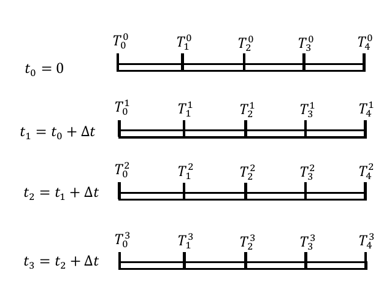
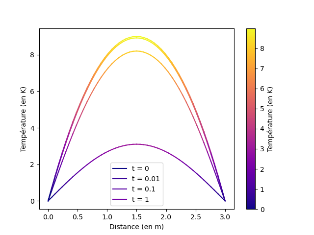
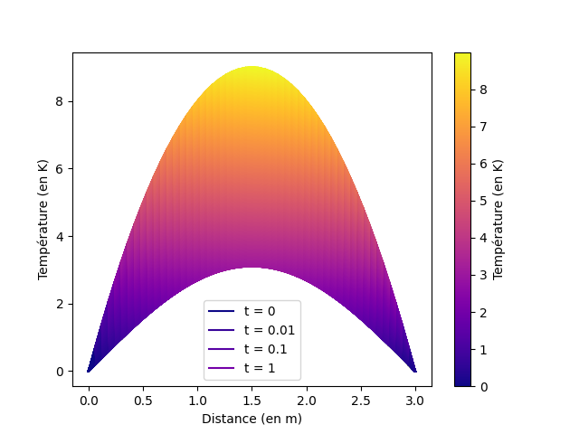
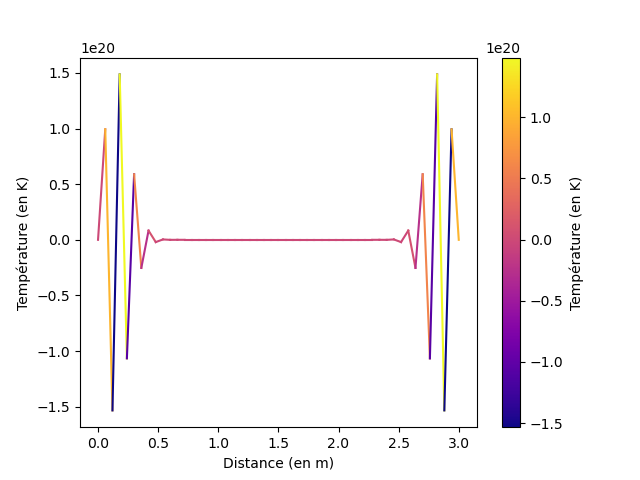

# Compte rendu TP2 Calderon-Déchelette

On cherche a simplifier cette équation de la conduction thermique.
$(delT)/(delt)=D(del^2T)/(delx^2)$

On fera l'hypothèse qu'on se trouve dans un millieu à une dimension homogène et isotrope.

## Condition initiales

Au départ, la température du centre est plus élevé que celle des bords.
On donne T en fonction de t (en seconde), x (en mètres) et L la longueur finale.
$T(x=0,t)=0$
$T(x=L,t)=0$
$T(x,t=0)=4x(3-x)$

## Équation discrétisée

$lim_(∆t→0)(⁡T^(n+1)_j-T^n_j)/Deltat=lim_((Deltax)^2→0)⁡D(T^n_(j+1)-2 T^n_j+ T^n_(j-1))/((Deltax)^2)$
$(⁡T^(n+1)_j-T^n_j)/Deltat=D(T^n_(j+1)-2 T^n_j+ T^n_(j-1))/((Deltax)^2)$
$(⁡T^(n+1)_j)/Deltat=D*(T^n_(j+1)-2 T^n_j+ T^n_(j-1))/((∆x)^2)+ (T^n_j)/(Deltat)$
$⁡T^(n+1)_j=D*(T^n_(j+1)-2 T^n_j+ T^n_(j-1))/((∆x)^2)+ T^n_j$


```{=latex}
\begin{center}
```
{width=40%}
```{=latex}
\end{center}
```

Nous avons employé la bibliothèque matplotlib en Python pour créer une représentation du système. 

## Résultats

On peut donc grâce à cette simulation calculer des valeurs :

```{=latex}
\begin{center}
```
{width=40%}
```{=latex}
\end{center}
```

(Discrétisation du temps: 10 000 et discrétisation de distance: 150)

On peut ensuite générer sur un grand nombre de valeurs:

```{=latex}
\begin{center}
```
{width=40%}
```{=latex}
\end{center}
```

Nous avons sélectionné une discrétisation de 15 points pour la distance et 50 intervalles de temps, pour t allant de 0 à 1 seconde.

## Interprétation et conditions limites

Le rapport maximum de notre systeme est de $0.5$ pour $(dt)/(dx)^2$ avec une diffusivité  $1$
On voit que la chaleur diminue plutôt rapidement au début, puis de plus en plus lentement au cours du temps.
De plus, nous remarquons que la valeur maximale de chaleur demeure constamment localisée au centre du système.

## on comprend pas mais tkt

Pour assurer une précision adéquate, il est essentiel de discrétiser à la fois dans le temps et dans l'espace de manière proportionnelle. Sinon, des écarts significatifs entre les différentes simulations peuvent se produire, entraînant des imprécisions considérables. 
Nous avons ainsi déterminé numériquement qu'avec une valeur donnée de $N_x$, le nombre de pas de temps $N_t$ doit être supérieur à environ $0.222$ fois $N_x$ (environ deux neuvièmes de $N_x$) pour obtenir des résultats satisfaisants.

Cas limite : $N_t = 0.222 * N_x^2$

Lorsque nous examinons les deltas, nous obtenons l'inégalité suivante :

$:l \frac{T_{\text{fin}}}{L} \left( \frac{\Delta t}{\Delta x^2} \right) < 0.5 \Rightarrow \frac{N_t}{N_x} \left( \frac{\Delta x}{\Delta x^2} \right) < 0.5$
Cette inégalité nous indique que pour obtenir une simulation stable, le rapport entre le nombre de pas de temps \( N_t \) et le nombre de pas d'espace \( N_x \), multiplié par le rapport entre le pas d'espace \( \Delta x \) et son carré, doit être inférieur à 0.5.

```{=latex}
\begin{center}
```
{width=40%}
```{=latex}
\end{center}
```